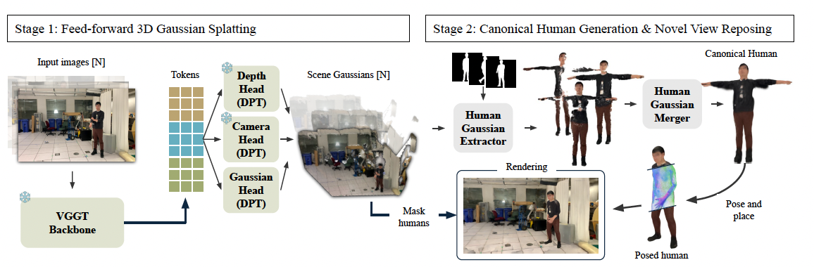

# Towards Feed-Forward Dynamic Human Scene Reconstruction using Gaussian Splatting

This repository contains the implementation of our 3DV 2025 course project:  
**Feed-forward Dynamic Scene Reconstruction with Humans Using Gaussian Splatting**  
We present a novel pipeline that reconstructs dynamic human-centric scenes from monocular videos using a feed-forward architecture built upon the VGGT backbone and Gaussian Splatting.

<p float="center">
  
</p>


## Installation
1. Clone this repository
2. Set-up conda environment and HUGS
```
conda create -n hugs310 python=3.10   pytorch=2.1.2   torchvision=0.16.2   torchaudio=2.1.2   pytorch-cuda=12.1   -c pytorch -c nvidia
conda activate hugs310
pip install fvcore iopath
cd pytorch3d
pip install -e .
cd ..
pip install submodules/diff-gaussian-rasterization
pip install submodules/simple-knn
pip install -r requirements.txt
```
3. Set-up VGGT by following their instructions
```
cd vggt
pip install -r requirements.txt
cd ..
```

4. Set-up Instantsplat by following their instructions
```
cd InstantSplat
mkdir -p mast3r/checkpoints/
wget https://download.europe.naverlabs.com/ComputerVision/MASt3R/MASt3R_ViTLarge_BaseDecoder_512_catmlpdpt_metric.pth -P mast3r/checkpoints/

pip install -r requirements.txt
pip install submodules/simple-knn
pip install submodules/diff-gaussian-rasterization-depth
pip install submodules/fused-ssim

```

## Running the Code

You can execute experiments and test stages using scripts under the vggt/ directory. For example:
```
python vggt/X.py
```

The pipeline is organized into standalone Python scripts for modularity and ease of execution. Each stage of the pipeline corresponds to a specific script under the vggt/ directory.

The main components of the pipeline are as follows:

- **Gaussian Head Training**:
  This stage trains the Gaussian head for dynamic human reconstruction. It uses the VGGT backbone to extract features and the InstantSplat framework for rendering.
  - Run: `python vggt/train_multiview_gaussian_head_euler.py`

- **Human Canonicalization** :
  This stage aligns and standardizes human poses to a canonical form.
  - Run: `python vggt/generate_canonical_human_multiview.py`

- **Scene Merging**:
  This stage extracts the scene by removing humans from the 3d scene results and merges the resulting scenes per time frame.
  - Run: `python vggt/get_merged_scene.py`

- **Merging Humans**:
  This stage merges individual canonical humans to a single one.
  - Run: `python vggt/merge_humans_learned.py` for learned merging or `python vggt/merge_humans.py` for simple merging.


*Notes*
- Scripts are designed to be executed independently depending on the experiment stage.
- Configurations (e.g., dataset paths, training parameters) are defined within each script for easy customization.
- Intermediate results (e.g., predicted Gaussians, canonical humans) are cached to avoid recomputation in later stages.


## Acknowledgements

Our project builds upon:

[HUGS](https://github.com/apple/ml-hugs), whose codebase we used initially.
[VGGT](https://github.com/facebookresearch/vggt) for the geometry-aware vision backbone.
[InstantSplat](https://github.com/NVlabs/InstantSplat) for the rendering framework.
We thank the authors for open-sourcing their work. Relevant code and configuration components are adapted and extended accordingly.